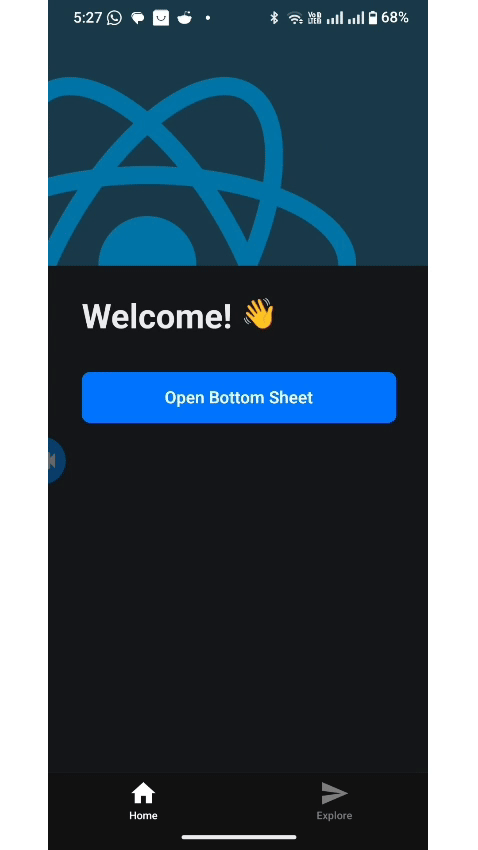

# React Native Bottom Sheet

A smooth, customizable bottom sheet component for React Native with gesture support and TypeScript definitions.





## Features

- 🎯 **TypeScript Support** - Full TypeScript definitions included
- 🎨 **Customizable** - Highly customizable appearance and behavior
- 📱 **Cross Platform** - Works on both iOS and Android
- ✋ **Gesture Support** - Smooth drag-to-dismiss functionality
- ⌨️ **Keyboard Aware** - Proper keyboard handling
- 🎭 **Flexible Content** - Support for any content with scroll view
- 🎪 **Animation** - Smooth enter/exit animations

## Installation

```bash
npm install szn-ui-react-native-bottom-sheet
```

### Peer Dependencies

This package requires the following peer dependencies:

```bash
npm install react-native-gesture-handler react-native-reanimated
```

Make sure to follow the installation instructions for:
- [react-native-gesture-handler](https://docs.swmansion.com/react-native-gesture-handler/docs/fundamentals/installation)
- [react-native-reanimated](https://docs.swmansion.com/react-native-reanimated/docs/fundamentals/getting-started)

## Usage

```tsx
import React, { useState } from 'react';
import { View, Text, Button } from 'react-native';
import { BottomSheet } from "szn-ui-react-native-bottom-sheet";

const App = (): JSX.Element => {
  const [isVisible, setIsVisible] = useState(false);

  return (
    <View style={{ flex: 1, justifyContent: 'center', alignItems: 'center' }}>
      <Button title="Open Bottom Sheet" onPress={() => setIsVisible(true)} />
      
      <BottomSheet
        isVisible={isVisible}
        onClose={() => setIsVisible(false)}
      >
        <View style={{ padding: 20 }}>
          <Text>Hello from bottom sheet!</Text>
        </View>
      </BottomSheet>
    </View>
  );
};

export default App;
```

## Props

| Prop              | Type         | Default               | Description                                                              |
| ----------------- | ------------ | --------------------- | ------------------------------------------------------------------------ |
| `isVisible`       | `boolean`    | **Required**          | Controls the visibility of the bottom sheet                              |
| `onClose`         | `() => void` | **Required**          | Callback when the sheet should be closed                                 |
| `children`        | `ReactNode`  | **Required**          | Content to render inside the bottom sheet                                |
| `height`          | `number`     | `SCREEN_HEIGHT * 0.9` | Height of the bottom sheet                                               |
| `backgroundColor` | `string`     | `'white'`             | Background color of the bottom sheet                                     |
| `showDragHandle`  | `boolean`    | `true`                | Whether to show the drag handle                                          |
| `containerStyle`  | `ViewStyle`  | `undefined`           | Additional styles for the sheet container                                |
| `title`           | `string`     | `undefined`           | Title text to display in the header                                      |
| `showHeader`      | `boolean`    | `false`               | Whether to show the header with title and cancel button                  |
| `cancelText`      | `string`     | `'Cancel'`            | Text for the cancel button in header                                     |

You can customize the sheet's background using either the backgroundColor prop or via containerStyle, but if both are provided, the backgroundColor prop takes precedence.
## Examples

### With Header

```tsx
<BottomSheet
  isVisible={isVisible}
  onClose={() => setIsVisible(false)}
  showHeader
  title="Settings"
  cancelText="Done"
>
  <View style={{ padding: 20 }}>
    <Text>Settings content here</Text>
  </View>
</BottomSheet>
```

### Custom Height

```tsx
<BottomSheet
  isVisible={isVisible}
  onClose={() => setIsVisible(false)}
  height={400}
>
  <View style={{ padding: 20 }}>
    <Text>Custom height content</Text>
  </View>
</BottomSheet>
```
### Multi-Step Flow
```tsx
const [step, setStep] = useState(1);

return (
  <BottomSheet
    isVisible={true}
    onClose={() => {}}
    height={step === 1 ? 200 : step === 2 ? 400 : 600}
  >
    {step === 1 && <StepOne onNext={() => setStep(2)} />}
    {step === 2 && <StepTwo onNext={() => setStep(3)} />}
    {step === 3 && <StepThree />}
  </BottomSheet>
);
```
### Custom Background Color
```tsx
<BottomSheet
  isVisible={isVisible}
  onClose={() => setIsVisible(false)}
  backgroundColor="#fef2f2"
>
  <View style={{ padding: 20 }}>
    <Text>Light pink background</Text>
  </View>
</BottomSheet>
```

### Custom Styling

```tsx
<BottomSheet
  isVisible={isVisible}
  onClose={() => setIsVisible(false)}
  containerStyle={{
    backgroundColor: '#f0f0f0',
    borderTopLeftRadius: 30,
    borderTopRightRadius: 30,
  }}
>
  <View style={{ padding: 20 }}>
    <Text>Custom styled content</Text>
  </View>
</BottomSheet>
```
### Full Usage Example
```tsx
import { useState } from "react";
import {
  KeyboardAvoidingView,
  Platform,
  Pressable,
  ScrollView,
  StyleSheet,
  TextInput,
} from "react-native";
import { BottomSheet } from "szn-ui-react-native-bottom-sheet";
import { ThemedText } from "@/components/themed-text";
import { ThemedView } from "@/components/themed-view";
import ParallaxScrollView from "@/components/parallax-scroll-view";
import { Image } from "expo-image";
import { HelloWave } from "@/components/hello-wave";

export default function HomeScreen() {
  const [isBottomSheetVisible, setIsBottomSheetVisible] = useState(false);
  const [inputValue, setInputValue] = useState("");

  const openBottomSheet = () => setIsBottomSheetVisible(true);
  const closeBottomSheet = () => setIsBottomSheetVisible(false);

  return (
    <>
      <ParallaxScrollView
        headerBackgroundColor={{ light: "#A1CEDC", dark: "#1D3D47" }}
        headerImage={
          <Image
            source={require("@/assets/images/partial-react-logo.png")}
            style={styles.reactLogo}
          />
        }
      >
        <ThemedView style={styles.titleContainer}>
          <ThemedText type="title">Welcome!</ThemedText>
          <HelloWave />
        </ThemedView>

        <ThemedView style={styles.stepContainer}>
          <Pressable style={styles.bottomSheetButton} onPress={openBottomSheet}>
            <ThemedText style={styles.buttonText}>Open Bottom Sheet</ThemedText>
          </Pressable>
        </ThemedView>
      </ParallaxScrollView>

      <BottomSheet isVisible={isBottomSheetVisible} onClose={closeBottomSheet}>
        <KeyboardAvoidingView
          behavior={Platform.OS === "ios" ? "padding" : undefined}
          style={{ flex: 1 }}
        >
          <ScrollView contentContainerStyle={styles.bottomSheetContent}>
            <ThemedText type="subtitle">Bottom Sheet Test</ThemedText>
            <ThemedText>Your bottom sheet package is working!</ThemedText>

            <TextInput
              placeholder="Type something here..."
              value={inputValue}
              onChangeText={setInputValue}
              style={styles.textInput}
              placeholderTextColor="#999"
            />

            <Pressable style={styles.closeButton} onPress={closeBottomSheet}>
              <ThemedText style={styles.buttonText}>Close</ThemedText>
            </Pressable>
          </ScrollView>
        </KeyboardAvoidingView>
      </BottomSheet>
    </>
  );
}

const styles = StyleSheet.create({
  titleContainer: {
    flexDirection: "row",
    alignItems: "center",
    gap: 8,
  },
  stepContainer: {
    gap: 8,
    marginBottom: 8,
  },
  reactLogo: {
    height: 178,
    width: 290,
    bottom: 0,
    left: 0,
    position: "absolute",
  },
  bottomSheetButton: {
    backgroundColor: "#007AFF",
    paddingHorizontal: 20,
    paddingVertical: 12,
    borderRadius: 8,
    alignItems: "center",
    marginVertical: 20,
  },
  buttonText: {
    color: "#FFFFFF",
    fontWeight: "600",
  },
  bottomSheetContent: {
    padding: 20,
    alignItems: "center",
    gap: 16,
  },
  textInput: {
    width: "100%",
    paddingHorizontal: 16,
    paddingVertical: 12,
    borderRadius: 8,
    borderWidth: 1,
    borderColor: "#ccc",
    color: "#000",
  },
  closeButton: {
    backgroundColor: "#FF3B30",
    paddingHorizontal: 20,
    paddingVertical: 10,
    borderRadius: 6,
    alignItems: "center",
  },
});
```

## License

MIT

## Contributing

Contributions are welcome! Please feel free to submit a Pull Request.